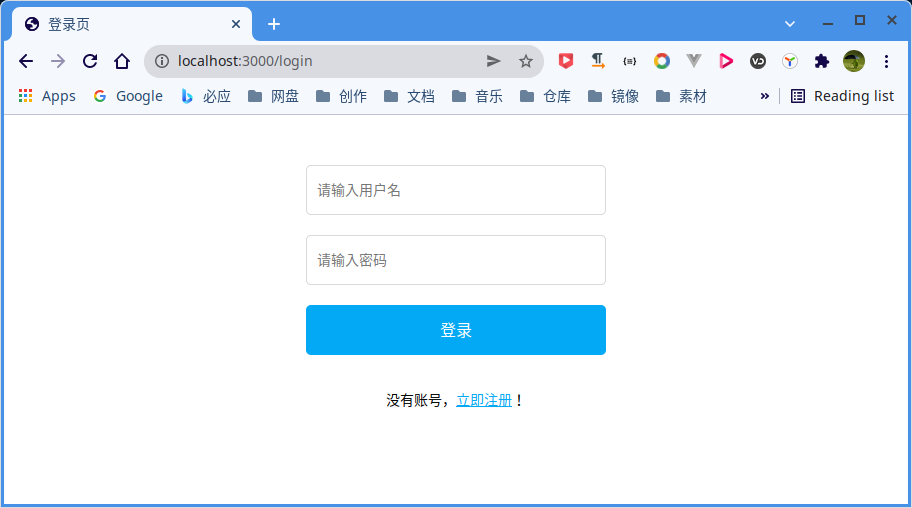
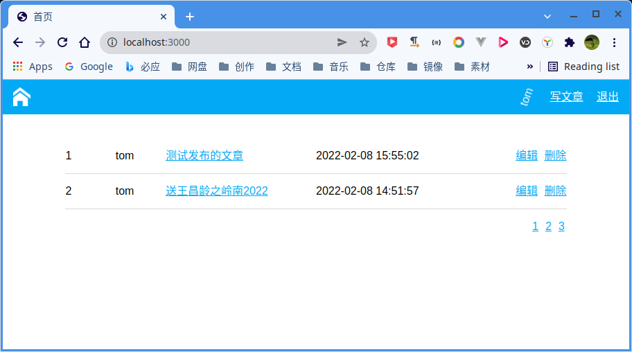
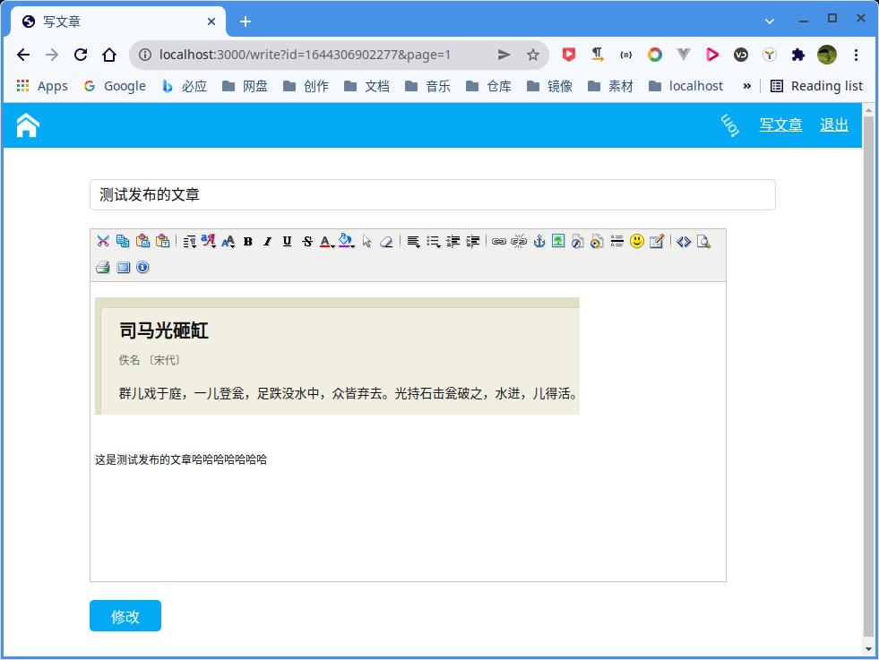
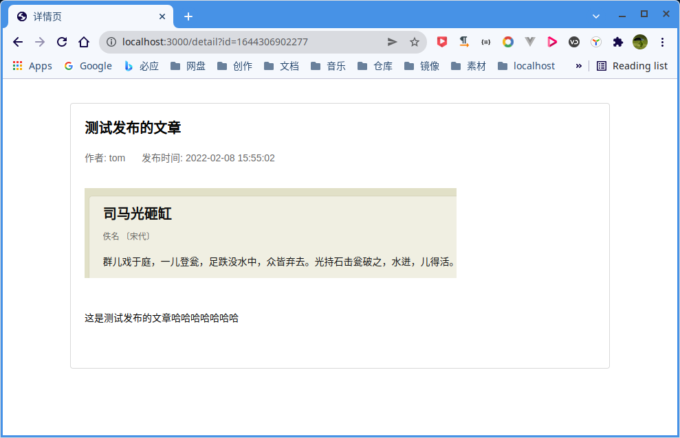

# NodeJS+Express+MongoDB实战项目开发教程

## 1. 概述

参考视频：[https://www.bilibili.com/video/BV15J411d7T2](https://www.bilibili.com/video/BV15J411d7T2)

> 该项目已经实现视频中的所有功能

**项目截图**

- 登录页


- 首页


- 文章创建与编辑页


- 文章详情页



### 1.1. 核心依赖
本项目是基于 nodejs + mongodb 的实战项目，核心依赖包如下：

- `express`: 核心组件，用于控制路由，转发请求
- `express-session`: 用于存储用户的登录状态
- `moment`: 时间处理，在本项目中将时间戳格式化为时间字符串
- `mongodb`: 用于连接mongodb
- `multiparty`: 用于处理文件上传

### 1.2. 附加组件

富文本编辑器：[xhEditor](https://github.com/yaniswang/xhEditor)


## 2. 运行

### 2.1. 环境需求

- `nodemon`: 我用2.0.15，用于启动项目，安装命令是 `npm install nodemon -g`
- `mondb`: 我用5.0.5，可以使用docker快速安装
- `nodejs`: 我用14.18.3，可以使用nvm 快速管理node版本，在一个操作系统中使用多个node版本
- `npm`: 我用6.14.15，安装node 14.18.3时自带的


### 2.1. 启动项目

拉取代码

```shell
git clone https://github.com/kotlindev/Express-Mongo-Demo.git
```


修改配置

- `model/index.js`: 修改 mogodb 连接参数，改为你自己的地址
- `bin/www`: 可选，修改 www 启动脚本中的端口，避免与已经端口冲突，不改则是 3000


安装依赖

```shell
npm install
```


启动项目

```shell
npm start
```